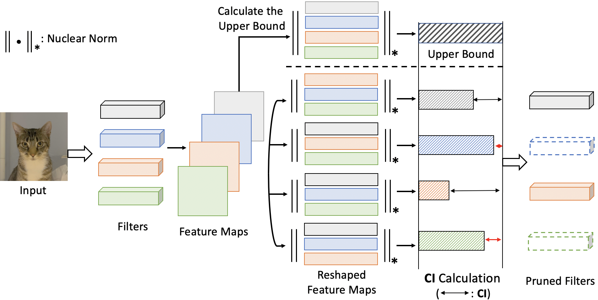

# In Progress
# CHIP: CHannel Independence-based Pruning for Compact Neural Networks

## Code for our NeurIPS 2021 paper: ([CHIP: CHannel Independence-based Pruning for Compact Neural Networks](https://arxiv.org/abs/2110.13981)).

<p align="center">

</p>

## Usage

### Generate Feature Maps.
##### 1. CIFAR-10
```shell
python calculate_feature_maps.py \
--arch resnet_56 \
--dataset cifar10 \
--data_dir ./data \
--pretrain_dir ./pretrained_models/resnet_56.pt \
--gpu 0
```
##### 2. ImageNet
```shell
python calculate_feature_maps.py \
--arch resnet_50 \
--dataset imagenet \
--data_dir /raid/data/imagenet \
--pretrain_dir ./pretrained_models/resnet50.pth \
--gpu 0
```
### Generate Channel Independence (CI).
##### 1. CIFAR-10
```shell
python calculate_ci.py \
--arch resnet_56 \
--repeat 5 \
--num_layers 55
```
##### 2. ImageNet
```shell
python calculate_ci.py \
--arch resnet_50 \
--repeat 5 \
--num_layers 53
```

### Prune and Fine-tune Models.

##### 1. CIFAR-10
```shell
python prune_finetune_cifar.py \
--data_dir ./data \
--result_dir ./result/resnet_56/1 \
--arch resnet_56 \
--ci_dir ./CI_resnet_56 \
--batch_size 256 \
--epochs 200 \
--lr_type cos \
--learning_rate 0.01 \
--momentum 0.99 \
--weight_decay 0.001 \
--pretrain_dir ./pretrained_models/resnet_56.pt \
--sparsity [0.]+[0.4]*2+[0.5]*9+[0.6]*9+[0.7]*9 \
--gpu 0 
```
##### 2. ImageNet
```shell
python prune_finetune_imagenet.py \
--data_dir /raid/data/imagenet \
--result_dir ./result/resnet_50/1 \
--arch resnet_50 \
--ci_dir ./CI_resnet_50 \
--batch_size 256 \
--epochs 200 \
--lr_type cos \
--learning_rate 0.01 \
--momentum 0.99 \
--label_smooth 0.1 \
--weight_decay 0.0001 \
--pretrain_dir ./pretrained_models/resnet50.pth \
--sparsity [0.]+[0.1]*3+[0.35]*16 \
--gpu 0
```
### Results
##### CIFAR-10
TBD.

##### ImageNet
TBD.

## Others
Codes are based on [link](https://github.com/lmbxmu/HRankPlus).

## Citation
TBD.